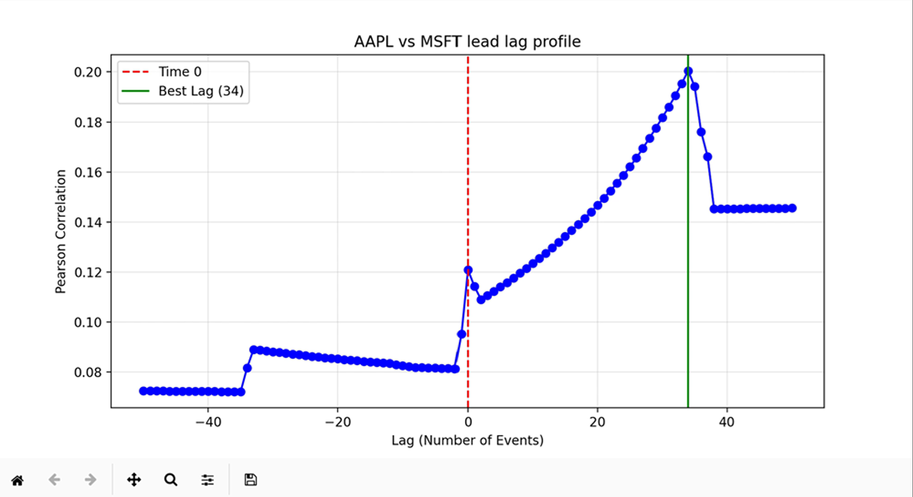

# 🔍 L3 Post-Mortem Market Analyzer

### _ITCH 5.0 Reconstruction & Microstructure Research_

## 📌 The Concept

This **demo** project is designed to analyse a completed day's trading in minute detail. This tool reconstructs the NASDAQ ITCH 5.0 tape into a full limit order book (L3) state machine. It allows researchers to study market behavior to understand the mechanics of liquidity and price discovery. The core of the engine was taken from the `HftDemo` project.  Storing market snapshots to Arrow was added (and saved to Parquet for compressed, columnar disk storage). 

> Historical replay and analysis video (included in /assets) illustrates ITCH packet ingestion, Parquet persistence, and statistical analysis in Python.

----------

## 🚀 Research Case Studies

As part of this demo project, three basic behaviors were selected to analyze and validate within the reconstructed data:

### 1. Order Queue Integrity (Fairness Audit)

We need to ensure the engine correctly reflects how the NASDAQ exchange actually works. Because NASDAQ uses a FIFO model, a position in line should depend strictly on the time of arrival.

-   **The Test:** Correlated order quantity against shares ahead.
    
-   **The Result:** A near-zero correlation proves the engine is "fair"—it treats a 10-share order and a 10,000-share order with the same temporal priority, confirming the engine is mathematically sound.
    

### 2. Queue Decay (The "Burn" Rate)

We measured how the line at a specific price moves over time as orders are filled or cancelled.

-   **The Test:** Tracking the average number of shares in front of an order from the moment it is added to the moment it is executed.
    
-   **The Result:** The data showed a clear natural decay (e.g., dropping from 2,084 to 738 shares ahead). This quantifies the velocity of the market and helps predict how long an order must wait before being filled.
    

### 3. Cross-Asset Lead-Lag (The Alpha Signal)

We analysed the relationship between two different stocks to see if one "predicts" the other.

-   **The Test:** We synchronized AAPL and MSFT mid-prices and ran a correlation across 100 different time-lags.
    
-   **The Result:** We discovered a 34-event lag where AAPL acts as a leading indicator. This identifies a predictive window where one asset's price action is "echoed" by the other 34 messages later. 

----------
## 🏁 Future Work: Refining Backtest Assumptions (The "Ghost Order")

A major limitation in basic backtesting is the ghost order, assuming your trade executes perfectly without simulating your own impact on the market. While this project is a passive analyzer, it provides the data needed to reduce these assumptions in future real simulation program.

By tracking queue position, we move away from instant fills and toward a model that respects the reality of the FIFO line.  The lead lag signals identified here allow us to begin modeling adverse selection—simulating how other participants might react or cancel their orders if they see our activity in a correlated symbol.
       
----------

## 🤖 The Role of AI Here

While the core engine was based on `HftDemo`, the primary challenge was integrating the Arrow-based snapshot feature and building the research pipeline so limited usage of AI here.

One interesting observation was that when I first dumped the parquet file, for both symbols there was over 90% crossed orders. Ultimately it took ~1hr of looking through order book code until as I was checking the ITCH spec I saw I missed `Replace Order` in `HftDemo`.  As a test I decided to see how long it took Gemini to figure it out.  Within ~20 minutes of adding some logs it had reviewed the itch-parser code and saw the missing order type.

Data analysis using pandas/polars was entirely new territory for me.  While I did the deep-dive research to understand the _why_, the AI was excellent for writing and iterating on the Python analysis scripts. 